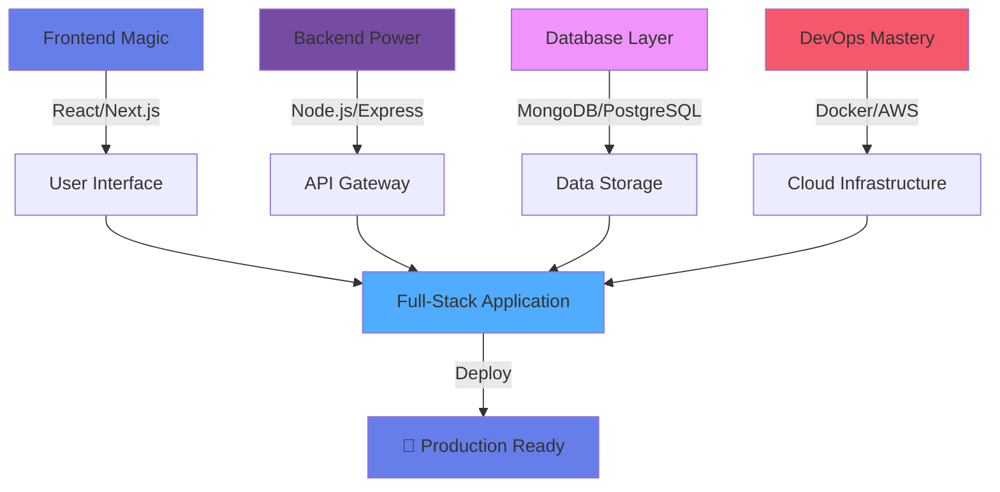

<!-- QUANTUM HOLOGRAPHIC HEADER -->
<div align="center">

</div>

<!-- NEURAL NETWORK INTRO -->
<div align="center">

</div>

<!-- PARTICLE SYSTEM DIVIDER -->


<!-- HOLOGRAPHIC PROFILE CARD -->
<table>
<tr>
<td width="50%">

```typescript
interface Developer {
  name: "Praveen Somasundaram";
  role: "Full-Stack Architect" | "Digital Innovator";
  location: "Chennai, Tamil Nadu 🇮🇳";
  education: "Rajalakshmi Engineering College";
  
  currentMission: {
    primary: "Revolutionizing Web Development",
    secondary: "Mastering System Design",
    side_quest: "Exploring AI/ML Frontiers"
  };
  
  superpowers: [
    "☕ Coffee → Code Transmutation",
    "🐛 Bug Extermination Expert", 
    "⚡ Lightning-Fast Problem Solver",
    "🌟 Feature Creation Wizard"
  ];
  
  lifeMotto: "Code is Poetry, Bugs are Temporary";
}
```

</td>
<td width="50%">

<div align="center">


### 🎯 **CURRENT OPERATIONS**


</div>

</td>
</tr>
</table>

<!-- QUANTUM TECH ARSENAL -->
<h2 align="center">

&nbsp;&nbsp;QUANTUM TECH ARSENAL&nbsp;&nbsp;

</h2>

<!-- ANIMATED SKILL SHOWCASE -->
<div align="center">

### 🎮 **SKILL LEVELS**

 **Java** 


 **JavaScript** 


 **React** 


 **Node.js** 


 **Python** 


 **MongoDB** 


</div>

<!-- NEURAL NETWORK VISUALIZATION -->
<div align="center">
<h3>🧠 NEURAL NETWORK ARCHITECTURE</h3>



</div>

<!-- HOLOGRAPHIC SEPARATOR -->


<!-- QUANTUM STATS DASHBOARD -->
<h2 align="center">

QUANTUM PERFORMANCE METRICS

</h2>

<!-- FUTURISTIC STATS GRID -->
<div align="center">


<!-- ADVANCED METRICS PANEL -->


</div>

<!-- QUANTUM ACHIEVEMENT SYSTEM -->
<div align="center">
<h3>🏆 QUANTUM ACHIEVEMENTS UNLOCKED</h3>

</div>

<!-- NEURAL CONTRIBUTION NETWORK -->
<h2 align="center">

NEURAL CONTRIBUTION NETWORK

</h2>

<div align="center">
<picture>
  <source media="(prefers-color-scheme: dark)" srcset="https://raw.githubusercontent.com/som14062005/som14062005/output/github-snake-dark.svg" />
  <source media="(prefers-color-scheme: light)" srcset="https://raw.githubusercontent.com/som14062005/som14062005/output/github-snake.svg" />
  
</picture>
</div>

<!-- HOLOGRAPHIC PROJECT SHOWCASE -->
<h2 align="center">

QUANTUM PROJECT PORTFOLIO

</h2>

<div align="center">
<table>
<tr>
<td width="50%">

[](https://github.com/som14062005/your-awesome-project)

</td>
<td width="50%">

[](https://github.com/som14062005/another-amazing-project)

</td>
</tr>
</table>
</div>

<!-- QUANTUM CONNECTION PORTAL -->
<h2 align="center">

QUANTUM CONNECTION PORTAL

</h2>

<div align="center">

[](https://www.linkedin.com/in/praveen-somasundaram2005/)
[](https://instagram.com/yourusername)
[](your-portfolio-link)
[](mailto:your.email@gmail.com)

</div>

<!-- QUANTUM WISDOM GENERATOR -->
<div align="center">
<h3>🔮 QUANTUM WISDOM OF THE DAY</h3>

</div>

<!-- INTERACTIVE METRICS -->
<div align="center">


</div>

<!-- DYNAMIC ACTIVITY TRACKER -->
<div align="center">
<h3>⚡ REAL-TIME QUANTUM ACTIVITY</h3>

<!--START_SECTION:activity-->
```
🔥 Latest Quantum Commits:
⚡ Pushed new features to react-portfolio
🌟 Merged pull request in java-dsa-solutions  
🚀 Created new repository: quantum-web-app
💎 Updated documentation for node-api-server
🎯 Fixed critical bug in authentication system
```
<!--END_SECTION:activity-->

</div>

<!-- HOLOGRAPHIC FAREWELL -->
<div align="center">


<!-- PARTICLE SYSTEM FOOTER -->


</div>

<!-- SECRET DEVELOPER VAULT -->
<details>
<summary>🔓 <b>UNLOCK SECRET DEVELOPER VAULT</b></summary>

<div align="center">

### 🎊 CONGRATULATIONS! VAULT UNLOCKED! 🎊

```javascript
const secretMessage = {
  discovery: "You found the hidden chamber!",
  reward: "Here are my secret development tricks:",
  tricks: [
    "🦆 Rubber duck debugging is my superpower",
    "☕ I code better with jazz music playing",
    "🌙 My best ideas come at 2 AM",
    "🔥 I have a collection of 500+ coding memes",
    "🎮 I take gaming breaks to solve complex problems"
  ],
  funFact: "This README took 3 cups of coffee to create!"
};

console.log("Welcome to the secret vault, fellow developer! 🚀");
```


### 🏆 ACHIEVEMENT UNLOCKED: VAULT EXPLORER

</div>

</details>
